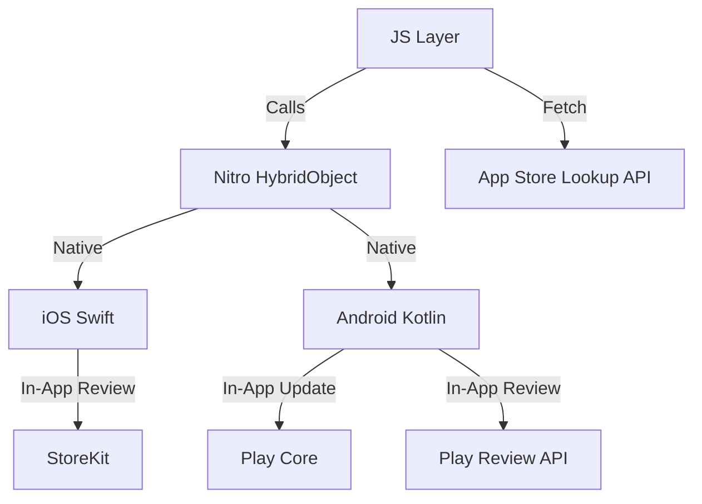

# @minhnc/nitro-app-updater

High-performance, lightweight App Update checker for React Native, built with [Nitro Modules](https://nitro.margelo.com).

Features:

- 🚀 **Fast**: Uses C++/JSI Native Modules.
- 📱 **Native**: Supports **checkPlayStoreUpdate** (Play Core) on Android and iTunes Lookup on iOS.
- 🔄 **Flexible Updates**: Supports background downloads with progress tracking on Android.
- ⭐️ **In-App Reviews**: Trigger native review prompts for App Store/Play Store.
- 🎨 **UI Included**: Premium `UpdatePrompt` component.
- 🛡️ **Safe**: No scraping on Android (uses Play Core API).

## Architecture



## Compatibility

| Platform         | Minimum Version | Notes                                 |
| ---------------- | --------------- | ------------------------------------- |
| **iOS**          | 13.4+           | Requires Swift 5.9+ (Xcode 15+)       |
| **Android**      | 6.0+ (API 23)   | Uses Play Core In-App Updates         |
| **React Native** | 0.73+           | Recommended for automatic C++ Interop |
| **Expo**         | SDK 50+         | Via Config Plugin                     |

## Installation

```sh
bun add @minhnc/nitro-app-updater
# Install Peer Dependencies
bun add react-native-nitro-modules
cd ios && pod install
```

> [!IMPORTANT]
> This package requires **Swift C++ Interoperability**. Most modern React Native versions (0.73+) handle this automatically.

### Scripts

The package includes standard scripts for development:

- `npm run typecheck`: Run TypeScript type checking.
- `npm run lint`: Lint the codebase.
- `npm run test`: Run unit tests.
- `npm run generate`: Generate native bindings (Nitrogen).
- `npm run build`: Compile TypeScript.

### Expo Setup (Managed Workflow)

If you are using Expo, add the following to your `app.json` or `app.config.js`:

```json
{
  "expo": {
    "plugins": ["@minhnc/nitro-app-updater"]
  }
}
```

This plugin automatically configures the necessary **C++ Interop Mode** and **C++ Standard Library** settings for you. Remember to rebuild your dev client with `npx expo run:ios` or `npx expo run:android` after adding the plugin.

## Usage

### 1. Basic Usage (Component)

Simply mount the component at the root of your app.

```tsx
import { UpdatePrompt } from "@minhnc/nitro-app-updater";

export default function App() {
  return (
    <>
      <YourApp />
      <UpdatePrompt config={{ checkOnMount: true }} />
    </>
  );
}
```

### 2. Custom Hook

```tsx
import { useAppUpdater } from "@minhnc/nitro-app-updater";

function MyCustomUpdater() {
  // Explicitly typing the hook return for better DX
  const {
    available,
    startUpdate,
    downloadProgress,
    completeUpdate,
    isReadyToInstall,
    requestReview,
    canRequestReview,
    lastReviewPromptDate,
    checkUpdate, // returns Promise<UpdateState>
  } = useAppUpdater({
    onDownloadComplete: () => {
      console.log("Download finished! Ready to install.");
      // Trigger confetti or navigation
    },
  });

  if (available) {
    // ...
  }

  return (
    <Button
      onPress={requestReview}
      title="Rate Us"
      disabled={!canRequestReview}
    />
  );
}
```

### 3. Comprehensive Example

This example demonstrates how to use **Debug Mode** to test the UI, listen to **Analytics Events**, and customize the **Theme**.

```tsx
import React from "react";
import { View, StyleSheet, Alert } from "react-native";
import { UpdatePrompt, type AppUpdaterEvent } from "@minhnc/nitro-app-updater";

export default function App() {
  const handleEvent = (event: AppUpdaterEvent) => {
    console.log(`[Analytics] ${event.type}`, event.payload);

    if (event.type === "update_dismissed" && event.payload.error) {
      Alert.alert("Error", event.payload.error.message);
    }
  };

  return (
    <View style={styles.container}>
      <UpdatePrompt
        config={{
          checkOnMount: true,
          debugMode: __DEV__, // Only enable in development
          minRequiredVersion: "1.0.0",
          iosCountryCode: "us",
        }}
        title="✨ New Update!"
        message="We have added cool new features. Update now to explore!"
        theme={{
          primary: "#FF5733", // Custom Brand Color
          background: "#FFFFFF",
          text: "#333333",
          overlay: "rgba(0,0,0,0.8)",
        }}
        onEvent={handleEvent}
      />

      {/* Your App Content */}
    </View>
  );
}

const styles = StyleSheet.create({
  container: {
    flex: 1,
    backgroundColor: "#fff",
  },
});
```

## Android Setup

Ensure you have the Play Core library dependencies (handled automatically by this package).
**Important**: Testing In-App Updates on Android requires:

1. Building a signed APK/AAB.
2. Uploading to **Internal Testing** track on Google Play.
3. Downloading the app from the Play Store (or having an older version installed with the same signature).

## iOS Setup

Uses standard iTunes Lookup API. No extra config needed.

## Configuration

| Prop                 | Type       | Description                                              |
| -------------------- | ---------- | -------------------------------------------------------- |
| `minRequiredVersion` | `string`   | Minimum version to force update (e.g. "1.5.0")           |
| `iosCountryCode`     | `string`   | Country code for iOS App Store lookup (default: "us")    |
| `checkOnMount`       | `boolean`  | Whether to check for updates on mount (default: true)    |
| `debugMode`          | `boolean`  | Mock update availability for testing (default: false)    |
| `reviewCooldownDays` | `number`   | Days between in-app review prompts (default: 120)        |
| `iosStoreId`         | `string`   | iOS App Store numeric ID for fallback URL                |
| `minOsVersion`       | `string`   | Minimum OS version required (iOS version or Android API) |
| `onDownloadComplete` | `function` | Callback when flexible update finishes (Android only)    |
| `onEvent`            | `function` | Unified event callback for analytics/logging             |

## Analytics & Callbacks

### Unified Event Handler (Recommended)

Use the `onEvent` callback for streamlined analytics integration:

```tsx
import { useAppUpdater, type AppUpdaterEvent } from "@minhnc/nitro-app-updater";

const { startUpdate } = useAppUpdater({
  onEvent: (event: AppUpdaterEvent) => {
    analytics.track(event.type, event.payload);
  },
});

// Event types:
// - update_available: { version: string }
// - update_accepted
// - update_dismissed: { error?: AppUpdaterError }
// - update_downloaded
// - review_requested
// - review_completed
```

### Manual Review Button (Recommended)

Deep linking to the store's "Write a Review" page is the best practice for manual buttons (e.g., in Settings), as it avoids OS quotas and ensures the action always works.

```tsx
import { useAppUpdater } from "@minhnc/nitro-app-updater";

function SettingsScreen() {
  const { openStoreReviewPage } = useAppUpdater({
    iosStoreId: "123456789", // Required for iOS deep link
  });

  return (
    <Button title="Rate Us on the Store ⭐" onPress={openStoreReviewPage} />
  );
}
```

## Local Development

To test this package locally in an **Expo** or **React Native** project:

1.  **Generate Native Bindings**:

    ```bash
    npm run generate
    ```

2.  **Compile TypeScript**:

    ```bash
    npm run build
    ```

3.  **Pack the library**:

    ```bash
    npm pack
    # Generates a file like minhnc-nitro-app-updater-1.0.0.tgz
    ```

4.  **Install in your app**:

    ```bash
    cd /path/to/your/app
    bun add /path/to/minhnc-nitro-app-updater-1.0.0.tgz
    ```

5.  **Rebuild Dev Client**:
    Since this package contains native code (Nitro Modules), **Expo Go will not work**. You must rebuild your Development Client:

    ```bash
    # iOS
    npx expo run:ios

    # Android
    npx expo run:android
    ```

## Example App

A standalone Expo example app is available in the `/example` directory. It demonstrates all library features including update checks, flexible downloads, progress tracking, and in-app review prompts.

```bash
cd example
npm install
npm run ios    # or npm run android
```

> [!NOTE]
> Native Play Core features (real updates, reviews) require a signed build on the Google Play Store to fully test.

## Roadmap

### ✅ Completed

- **Custom Error Classes**: Typed `AppUpdaterError` with error codes
- **Memory Management (Android)**: Lifecycle observer for promise cleanup
- **TypeScript Strictness**: Static imports and ESLint configuration
- **Unit Testing**: Jest test suite
- **Flexible Update Progress (Android)**: Download progress for Play Core updates
- **In-App Review Prompt**: Support for StoreKit and Play Review with cooldown tracking
- **Configurable Review Cooldown**: `reviewCooldownDays` option (default: 120 days)
- **Unified Event Callbacks**: `onEvent` handler for analytics integration
- **Example App**: Standalone Expo example app

### 🚧 Planned

| Feature                    | Description                                                 |
| -------------------------- | ----------------------------------------------------------- |
| **Smart Review Triggers**  | Built-in positive action counter with auto-prompt           |
| **Update Reminder**        | Track dismiss date, re-show after X days                    |
| **What's New Component**   | `<WhatsNew />` component to show release notes after update |
| **Expo OTA Support**       | Optional integration with `expo-updates`                    |
| **Custom Backend Support** | JSON manifest endpoint                                      |
| **Localization**           | i18n support                                                |
| **Strict Force Update**    | Non-dismissable prompt                                      |
| **CI/CD**                  | GitHub Actions                                              |

## Contributing

Contributions are welcome! Please open an issue or submit a pull request.

## License

MIT
