# @minhnc/nitro-app-updater

[](https://www.npmjs.com/package/@minhnc/nitro-app-updater)
[](https://github.com/minhnc/nitro-app-updater/blob/main/LICENSE)
[](https://github.com/minhnc/nitro-app-updater/stargazers)

**High-performance, JSI-powered In-App Update and Store Review manager for React Native & Expo.**

Leveraging [Nitro Modules](https://nitro.margelo.com), this library provides a lightning-fast way to check for app updates and manage user reviews without the bridge overhead. It supports **Android Play Core** for flexible/immediate updates and **iOS iTunes Lookup** with a built-in **Happiness Gate** to maximize positive store ratings.

Features:

- 🚀 **Fast**: Uses C++/JSI Native Modules.
- 📱 **Native**: Supports **checkPlayStoreUpdate** (Play Core) on Android and iTunes Lookup on iOS.
- 🔄 **Flexible Updates**: Supports background downloads with progress tracking on Android.
- ⭐️ **In-App Reviews**: Trigger native review prompts for App Store/Play Store.
- 🎨 **UI Included**: Premium `UpdatePrompt` component.
- 🛡️ **Safe**: No scraping on Android (uses Play Core API).

## Demos

| iOS                                               | Android                                               |
| ------------------------------------------------- | ----------------------------------------------------- |
| <video src="example/demos/ios.mp4" width="320" /> | <video src="example/demos/android.mp4" width="320" /> |

> [!NOTE]
> Demo videos are hosted in the repository. If they do not render on your platform (e.g., NPM), please view them on [GitHub](https://github.com/minhnc/nitro-app-updater).

## Architecture


## Compatibility

| Platform         | Minimum Version | Notes                                                                |
| ---------------- | --------------- | -------------------------------------------------------------------- |
| **iOS**          | 13.4+           | Requires Swift 5.9+ (Xcode 16.4+)                                    |
| **Android**      | 6.0+ (API 23)   | Uses Play Core In-App Updates, compileSdkVersion 34+, ndkVersion 27+ |
| **React Native** | 0.75+           | JSI-based (New Architecture/Bridgeless)                              |
| **Expo**         | SDK 51+         | Works out of the box (no config plugin required)                     |

## Installation

```sh
bun add @minhnc/nitro-app-updater
# Install Peer Dependencies
bun add "react-native-nitro-modules@>=0.33.9"
cd ios && pod install
```

> [!IMPORTANT]
> This package requires **Swift C++ Interoperability**. Most modern React Native versions (0.73+) handle this automatically.

### Scripts

The package includes enhanced scripts for development:

- `bun run check`: Run linting and type checking (ideal for CI).
- `bun run clean`: Remove build and generation artifacts (`lib`, `nitrogen`).
- `bun run generate`: Generate native bindings (Nitrogen).
- `bun run build`: Compile TypeScript.
- `bun run watch`: Compile TypeScript in watch mode.
- `bun run test`: Run unit tests.
- `bun run test:watch`: Run unit tests in watch mode.
- `bun run pack:local`: Build and package the library as a `.tgz` for local testing.
- `bun run release`: Verify (lint, typecheck, test) and publish the package to NPM.

#### Example App Shortcuts

Run commands for the `/example` app directly from the root:

- `bun run example:ios`: Build and run on iOS.
- `bun run example:android`: Build and run on Android.
- `bun run example:start`: Start the Expo dev server.
- `bun run example:prebuild`: Run expo prebuild in the example directory.
- `bun run example:install`: Build the library and install the latest `.tgz` into the example app.

## Usage

### 1. Basic Usage (Component)

Simply mount the component at the root of your app.

```tsx
import { UpdatePrompt } from "@minhnc/nitro-app-updater";

export default function App() {
  return (
    <>
      <YourApp />
      <UpdatePrompt
        config={{ iosStoreId: "YOUR_APP_STORE_ID", checkOnMount: true }}
      />
    </>
  );
}
```

### 2. Provider & Context (Recommended)

To avoid prop-drilling or initializing the updater multiple times, wrap your app in `AppUpdaterProvider` and consume the state anywhere using `useAppUpdaterContext()`.

```tsx
import {
  AppUpdaterProvider,
  useAppUpdaterContext,
  UpdatePrompt,
} from "@minhnc/nitro-app-updater";

export default function App() {
  return (
    <AppUpdaterProvider config={{ iosStoreId: "YOUR_APP_STORE_ID" }}>
      <MyScreen />
    </AppUpdaterProvider>
  );
}

function MyScreen() {
  const updater = useAppUpdaterContext();
  const { requestReview, canRequestReview } = updater;

  return (
    <>
      <Button
        onPress={requestReview}
        title="Rate Us"
        disabled={!canRequestReview}
      />
      {/* Pass the shared context state to the drop-in UI component */}
      <UpdatePrompt externalUpdater={updater} />
    </>
  );
}
```

### 3. Custom Hook (Advanced Usage)

If you need multiple configurations or don't want to use the global context, you can use the `useAppUpdater` hook directly.

```tsx
import { useAppUpdater } from "@minhnc/nitro-app-updater";

function MyCustomUpdater() {
  // Explicitly typing the hook return for better DX
  const {
    available,
    startUpdate,
    downloadProgress,
    isDownloading,
    completeUpdate,
    isReadyToInstall,
    requestReview,
    canRequestReview,
    lastReviewPromptDate,
    checkUpdate, // returns Promise<UpdateState>
    resetSmartReview, // Reset win counts & prompt tracking
    error, // The last error encountered (AppUpdaterError)
  } = useAppUpdater({
    iosStoreId: "YOUR_APP_STORE_ID",
    onDownloadComplete: () => {
      console.log("Download finished! Ready to install.");
      // Trigger confetti or navigation
    },
  });

  if (available) {
    // ...
  }

  return (
    <Button
      onPress={requestReview}
      title="Rate Us"
      disabled={!canRequestReview}
    />
  );
}
```

### 4. Comprehensive Example

This example demonstrates how to use **Debug Mode** to test the UI, listen to **Analytics Events**, and customize the **Theme**.

```tsx
import React from "react";
import { View, StyleSheet, Alert } from "react-native";
import { UpdatePrompt, type AppUpdaterEvent } from "@minhnc/nitro-app-updater";

export default function App() {
  const handleEvent = (event: AppUpdaterEvent) => {
    console.log(`[Analytics] ${event.type}`, event.payload);

    if (event.type === "update_dismissed" && event.payload.error) {
      Alert.alert("Error", event.payload.error.message);
    }
  };

  return (
    <View style={styles.container}>
      <UpdatePrompt
        config={{
          iosStoreId: "YOUR_APP_STORE_ID",
          checkOnMount: true,
          debugMode: __DEV__, // Only enable in development
          minRequiredVersion: "1.0.0", // Forced update for users on versions < 1.0.0
          iosCountryCode: "us",
        }}
        title="✨ New Update!"
        message="We have added cool new features. Update now to explore!"
        theme={{
          primary: "#FF5733", // Custom Brand Color
          background: "#FFFFFF",
          text: "#333333",
          overlay: "rgba(0,0,0,0.8)",
        }}
        onEvent={handleEvent}
      />

      {/* Your App Content */}
    </View>
  );
}

const styles = StyleSheet.create({
  container: {
    flex: 1,
    backgroundColor: "#fff",
  },
});
```

## Android Setup

Ensure you have the Play Core library dependencies (handled automatically by this package).
**Important**: Testing In-App Updates on Android requires:

1. Building a signed APK/AAB.
2. Uploading to **Internal Testing** track on Google Play.
3. Downloading the app from the Play Store (or having an older version installed with the same signature).

> [!WARNING]
> For Android In-App Updates to resume correctly across app restarts (especially flexible updates), ensure your `MainActivity.kt` properly forwards `onNewIntent` or your app handles Activity recreations. Failing to do so might cause the update promise to hang if the app is killed during a background download.

## iOS Setup

Uses standard iTunes Lookup API. No extra config needed.

## Configuration

| Prop                  | Type       | Description                                                                                             |
| --------------------- | ---------- | ------------------------------------------------------------------------------------------------------- |
| `minRequiredVersion`  | `string`   | Minimum version users must be running to skip a forced update (e.g. "1.5.0")                            |
| `iosCountryCode`      | `string`   | Two-letter country code for App Store lookup (default: "us"). **Must change if app isn't in US store.** |
| `checkOnMount`        | `boolean`  | Whether to check for updates on mount (default: true)                                                   |
| `debugMode`           | `boolean`  | Mock update availability for testing (default: false)                                                   |
| `reviewCooldownDays`  | `number`   | Days between in-app review prompts (default: 120)                                                       |
| `iosStoreId`          | `string`   | **Required.** iOS App Store numeric ID for deep linking and fallback URL.                               |
| `iosLookupTimeoutMs`  | `number`   | Timeout for iOS App Store lookup in milliseconds (default: 10000)                                       |
| `minOsVersion`        | `string`   | **Deprecated.** Handled automatically by Store APIs. No longer required.                                |
| `onDownloadComplete`  | `function` | Callback when flexible update finishes (Android only)                                                   |
| `onEvent`             | `function` | Unified event callback for analytics/logging                                                            |
| `enabled`             | `boolean`  | Whether the entire updater is enabled (default: true). If `false`, neither updates nor reviews occur.   |
| `refreshOnForeground` | `boolean`  | Auto-check for updates when app returns to foreground (default: true)                                   |

### Smart Review Configuration (`smartReview` prop)

Pass these properties inside the `smartReview` object in your config:

> [!NOTE]
> Setting the global `enabled: false` completely deactivates the hook. If you want to keep update checks running but disable the Happiness Gate, leave the global `enabled` true and set `smartReview: { enabled: false }`.

| Property             | Type       | Description                                     |
| -------------------- | ---------- | ----------------------------------------------- |
| `enabled`            | `boolean`  | Enable the Smart Review Happiness Gate feature  |
| `winsBeforePrompt`   | `number`   | Positive actions before prompting (default: 3)  |
| `cooldownDays`       | `number`   | Days to wait before re-prompting (default: 120) |
| `maxPrompts`         | `number`   | Maximum times to show prompt (default: 1)       |
| `onNegativeFeedback` | `function` | Callback when user selects "Not really"         |

## Analytics & Callbacks

### Unified Event Handler (Recommended)

Use the `onEvent` callback for streamlined analytics integration:

```tsx
import { useAppUpdater, type AppUpdaterEvent } from "@minhnc/nitro-app-updater";

const { startUpdate } = useAppUpdater({
  onEvent: (event: AppUpdaterEvent) => {
    analytics.track(event.type, event.payload);
  },
});

// Event types:
// - update_available: { version: string }
// - update_accepted
// - update_dismissed: { error?: AppUpdaterError } // Fires on user dismiss OR unhandled errors
// - update_downloaded
// - review_requested
// - review_completed
```

> [!TIP]
> **Handle Failures Elegantly**: Always check for `event.payload.error` in the `update_dismissed` event. You can check the error code using the `AppUpdaterErrorCode` enum:
>
> ```tsx
> import { AppUpdaterErrorCode } from "@minhnc/nitro-app-updater";
>
> if (
>   event.type === "update_dismissed" &&
>   event.payload.error?.code === AppUpdaterErrorCode.NETWORK_ERROR
> ) {
>   // show retry toast
> }
> ```

### Manual Review Button (Recommended)

Deep linking to the store's "Write a Review" page is the best practice for manual buttons (e.g., in Settings), as it avoids OS quotas and ensures the action always works.

```tsx
import { useAppUpdater } from "@minhnc/nitro-app-updater";

function SettingsScreen() {
  const { openStoreReviewPage } = useAppUpdater({
    iosStoreId: "123456789", // Required for iOS deep link
  });

  return (
    <Button title="Rate Us on the Store ⭐" onPress={openStoreReviewPage} />
  );
}
```

### Clearing the Update Cache

If you need to force a fresh update check (e.g., after a user changes their regional settings or account), call:

```tsx
import { clearUpdateCache } from "@minhnc/nitro-app-updater";

clearUpdateCache();
```

> [!TIP]
> **Real-time freshness**: The update check results are cached for 5 minutes. The hook automatically handles clearing this cache when the app returns from the background (via `refreshOnForeground: true`). If you set this to `false`, you can manually manage it:
>
> ```tsx
> AppState.addEventListener("change", (state) => {
>   if (state === "active") clearUpdateCache();
> });
> ```

### Smart Review Triggers (Happiness Gate)

The Smart Review feature implements the ["Happiness Gate" pattern](https://medium.com/circa/the-right-way-to-ask-users-to-review-your-app-9a32fd604fca) to maximize positive reviews while diverting constructive feedback internally.

```tsx
import { useAppUpdater, UpdatePrompt } from "@minhnc/nitro-app-updater";

function App() {
  const { recordWin } = useAppUpdater({
    iosStoreId: "YOUR_APP_STORE_ID",
    smartReview: {
      enabled: true,
      winsBeforePrompt: 3, // Number of positive actions before prompting
      cooldownDays: 120, // Days to wait after prompt/dismiss
      maxPrompts: 1, // Total number of times to prompt
      onNegativeFeedback: () => {
        // Called when user indicates unhappiness - open your feedback form
        navigation.navigate("FeedbackForm");
      },
    },
  });

  return (
    <>
      <MainContent
        onTaskComplete={() => recordWin()} // Call when user achieves a "win"
      />
      <UpdatePrompt config={{ smartReview: { enabled: true } }} />
    </>
  );
}
```

#### Customizing Happiness Gate Text

Customize the gate text for localization or brand voice:

```tsx
<UpdatePrompt
  happinessGate={{
    title: "Loving these deals? 🔥",
    positiveText: "Absolutely!",
    negativeText: "Could be better",
    dismissText: "Ask me later",
  }}
  config={{ smartReview: { enabled: true } }}
/>
```

#### Flow Diagram

```mermaid
graph TD
    A[recordWin] --> B[Increment persistent wins]
    B --> C{Threshold reached?}
    C -- No --> End(( ))
    C -- Yes --> D[Show Happiness Gate]

    D --> E{Response}

    E -- "Yes! 😊" --> F[requestReview]
    F --> G{Can show native UI?}
    G -- Yes --> H[Native Review Prompt]
    G -- No --> I[Direct Link to App Store]
    H --> J[Mark Reviewed & Disable Prompt]
    I --> J

    E -- "Not really 😕" --> K[onNegativeFeedback]
    E -- "Maybe Later" --> L[Reset wins & Start Cooldown]
    K --> L

    J --> End
    L --> End
```



#### Smart Review Events

Listen for these events via `onEvent` for analytics:

- `win_recorded`: `{ count: number }` - A positive action was recorded
- `happiness_gate_shown`: `{}` - The gate modal was displayed
- `happiness_positive`: `{}` - User tapped "Yes"
- `happiness_negative`: `{}` - User tapped "Not really"
- `happiness_dismissed`: `{}` - User tapped "Maybe Later"

### How to test Smart Review (Happiness Gate)

Testing the Happiness Gate can be tricky due to production safety limits (cooldowns and prompt quotas). Use the following setup for reliable testing during development:

#### 1. The Debug Bypass

When `debugMode: true` is enabled in your config, the library automatically bypasses:

- **`maxPrompts` limit**: Ignores the production default of 1 prompt per user.
- **`hasCompletedReview`**: Allows showing the gate even if the user has already clicked "Yes".
- **Silent Failures**: On Android and in Debug mode, if the native prompt is inhibited by the OS, the library will automatically fallback to opening the Store Review page.

#### 2. Recommended Testing Config

To trigger the gate repeatedly in your simulator/emulator, use this configuration:

```tsx
const updater = useAppUpdater({
  iosStoreId: "YOUR_APP_STORE_ID",
  debugMode: true, // Bypasses prompt limits & enables fallbacks
  reviewCooldownDays: 0, // Allows the native prompt/redirect every time
  smartReview: {
    enabled: true,
    cooldownDays: 0, // Allows the gate to re-show immediately
    winsBeforePrompt: 3, // Set to a low number for quick testing
  },
});
```

#### 3. Manual Reset (The Power User Way)

If you've hit your prompt limits and want to test the flow from scratch without clearing app data, you can call the new `resetSmartReview` helper:

```tsx
const { resetSmartReview, recordWin } = useAppUpdater({
  iosStoreId: "YOUR_APP_STORE_ID",
});

// Attach this to a hidden debug button
<Button title="Reset for Testing" onPress={() => resetSmartReview()} />;
```

## Advanced Usage

### Using External Hook State

In complex apps where you might want to control the updater logic from a central store or a parent component, you can pass an `externalUpdater` instance to the `UpdatePrompt`.

This prevents the prompt from creating its own internal hook instance, allowing you to share the same updater state across multiple screens or components.

```tsx
import { useAppUpdater, UpdatePrompt } from "@minhnc/nitro-app-updater";

function Layout() {
  const updater = useAppUpdater({
    iosStoreId: "YOUR_APP_STORE_ID",
    checkOnMount: true,
  });

  return (
    <View style={{ flex: 1 }}>
      <YourApp />
      {/* Pass the updater result directly */}
      <UpdatePrompt externalUpdater={updater} />
    </View>
  );
}
```

> [!IMPORTANT]
> When using `externalUpdater`, the `config` prop on `UpdatePrompt` is ignored in favor of the configuration provided to your `useAppUpdater` call.

---

## Local Development

To test changes locally using the built-in **example app**:

1.  **Sync Changes**:
    Build the library and link it to the example app in one command:

    ```bash
    bun run example:install
    ```

2.  **Run Natively**:
    ```bash
    bun run example:ios    # or bun run example:android
    ```

For a detailed walkthrough of the developer workflow and how to contribute, see [CONTRIBUTING.md](./CONTRIBUTING.md).

## Example App

A standalone Expo example app is available in the `/example` directory. It demonstrates all library features including update checks, flexible downloads, progress tracking, and in-app review prompts.

```bash
cd example
bun install
bun run ios    # or bun run android
```

> [!NOTE]
> Native Play Core features (real updates, reviews) require a signed build on the Google Play Store to fully test.

## Roadmap

### ✅ Completed

- **Custom Error Classes**: Typed `AppUpdaterError` with error codes
- **Memory Management (Android)**: Lifecycle observer for promise cleanup
- **TypeScript Strictness**: Static imports and ESLint configuration
- **Unit Testing**: Jest test suite
- **Flexible Update Progress (Android)**: Download progress for Play Core updates
- **In-App Review Prompt**: Support for StoreKit and Play Review with cooldown tracking
- **Configurable Review Cooldown**: `reviewCooldownDays` option (default: 120 days)
- **Unified Event Callbacks**: `onEvent` handler for analytics integration
- **Example App**: Standalone Expo example app
- **Smart Review Triggers**: Built-in positive action counter with auto-prompt happiness gate.

### 🚧 Planned

| Feature                    | Description                                                 |
| -------------------------- | ----------------------------------------------------------- |
| **Update Reminder**        | Track dismiss date, re-show after X days                    |
| **What's New Component**   | `<WhatsNew />` component to show release notes after update |
| **Expo OTA Support**       | Optional integration with `expo-updates`                    |
| **Custom Backend Support** | JSON manifest endpoint                                      |
| **Localization**           | i18n support                                                |
| **Strict Force Update**    | Non-dismissable prompt                                      |

### Error Codes

The `AppUpdaterError` class includes the following codes:

| Code             | Description                                                                                                   |
| ---------------- | ------------------------------------------------------------------------------------------------------------- |
| `NOT_SUPPORTED`  | Feature not supported on this platform/version.                                                               |
| `NETWORK_ERROR`  | Failed to reach store APIs (iTunes/Play Store).                                                               |
| `STORE_ERROR`    | The store returned an error during the process.                                                               |
| `USER_CANCELLED` | The user dismissed or cancelled the update.                                                                   |
| `NO_ACTIVITY`    | (Android) No foreground activity found to host the UI.                                                        |
| `APP_NOT_OWNED`  | (Android) App not installed from Google Play (e.g. side-loaded). Handled gracefully as "no update available". |
| `UNKNOWN`        | An unexpected error occurred.                                                                                 |

### Troubleshooting

- **Android Play Core**: In-App Updates and Reviews require a signed build. They will **not** work in standard debug builds unless using the Internal App Sharing track or a signed APK/AAB uploaded to a testing track.
- **iOS Store IDs**: Manual review links require a numeric `iosStoreId`. If you see "Invalid Store URL" warnings in logs, ensure you've provided the numeric ID from App Store Connect.
- **C++ Standard conflicts**: If you encounter "invalid value for -std=c++20" or duplicate standard flag errors during build, ensure your project doesn't have conflicting `-std` flags in other native targets. The Nitro framework requires C++20.
- **Quota Limits**: Both iOS and Android enforce strict quotas on native review prompts. If a prompt doesn't show, it's likely being suppressed by the OS. The library automatically falls back to opening the store page in these cases when triggered manually.

## Contributing

Contributions are welcome!
Please open an issue or submit a pull request.

## License

MIT
